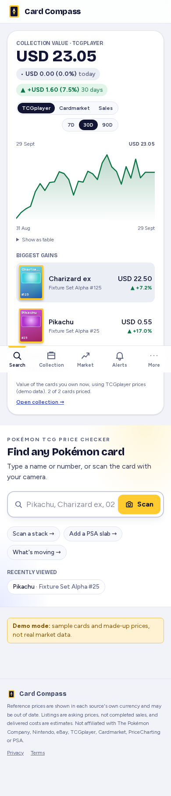
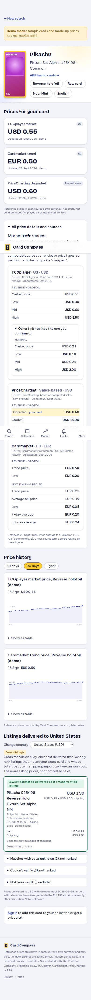
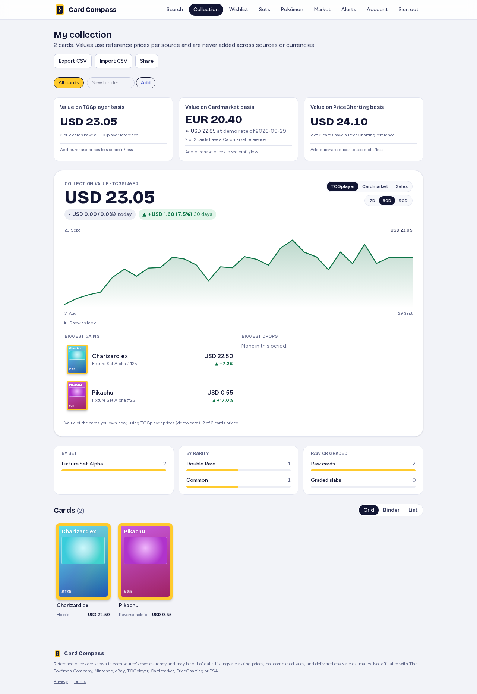

# Card Compass

An installable web app (PWA) for Pokémon TCG cards:

1. **Scan** a card with your phone camera, or search by name or number.
2. **Confirm** the exact printing, then compare **source-attributed reference prices**: TCGplayer (USD) and Cardmarket (EUR).
3. **Live listings from eBay**. Each listing is checked against your exact card, then ranked by **delivered cost to your country**. That cost is item + shipping + import VAT/duty, converted with dated ECB exchange rates. A listing is ranked only when every input is known; otherwise it is marked "total unknown".
4. **Accounts**: a saved **collection** with its value over time, plus **price alerts** that arrive as in-app notifications and web-push notifications on your phone.
5. **Collector tools**:
   - **Bulk scan**: a stack of cards, reviewed and added in one go.
   - **Binders**: folders for your collection.
   - **Profit/loss**: against what you paid, converted with dated FX when currencies differ.
   - **Wishlist**: an optional target price creates a price alert.
   - **Set completion**, **CSV import/export** (with a preview before anything is written), **price-history charts**, and **top movers** (7- and 30-day).
6. **Graded cards**:
   - Add a slab by **PSA cert number**; you confirm the printing and finish.
   - **PriceCharting** sales-based prices (ungraded and per grade) value graded items at their exact grade.
7. **Sharing**: read-only public links to your collection, a binder (e.g. a trade list) or your wishlist.
   - You choose whether values are shown.
   - Never shown: email, purchase prices, cert numbers.
   - Links are 128-bit random, noindex, and can be revoked immediately.

8. **Home and browsing**:
   - Signed in, the home screen opens on your **portfolio**: collection value per source (TCGplayer, Cardmarket, PriceCharting sales) with a 7/30/90-day chart, today's change, and the biggest gains and drops. Sources and currencies are never mixed.
   - The collection shows as a **picture grid**, a **3×3 binder** or a list (remembered per device). Tappable **insight cards** (by set, rarity, raw or graded) filter it.
   - **Completion rings** on sets, and **Browse by Pokémon**: every card of a Pokémon, with owned and missing filters.
   - **Accent colours** (yellow, blue, pink, green, purple) on the More page and in Account settings.
   - **Auto-capture**: the camera snaps by itself once the card is held still (can be switched off).

Out of the box everything runs in **demo mode**, with bundled, clearly labeled sample data and no credentials. Each integration switches on with an environment variable and your own API key.

| Portfolio home (mobile) | Results (mobile) | Collection (desktop) |
|---|---|---|
|  |  |  |

**Going live:** see [docs/DEPLOY.md](docs/DEPLOY.md) for the accounts, keys and hosting steps, and run `npm run check:live` to test your keys.

## Integrations and status

| Feature | Env switch | Status |
|---|---|---|
| Card catalog + reference prices | `CATALOG_PROVIDER=mock\|pokemontcg` | Demo fixtures by default. The Pokémon TCG API v2 adapter is implemented and unit-tested against mocked HTTP. **It still needs checking against the live API with your key**, because the network used to build this blocked the API. |
| OCR | `OCR_PROVIDER=mock\|google` | Mock OCR recognizes the bundled fixtures only. The Google Cloud Vision TEXT_DETECTION adapter is unit-tested; check it live. |
| Live listings | `OFFERS_PROVIDER=none\|mock\|ebay` | Demo listings by default. The eBay Browse API adapter (client-credentials token, search, item details) is unit-tested; check it live. TCGplayer and Cardmarket listings are **not** included: they aren't granting new API access. |
| Exchange rates | `FX_PROVIDER=mock\|ecb` | Demo rates by default. The ECB daily reference-rate adapter is unit-tested; check it live. |
| Sales-based + graded prices | `PRICECHARTING_PROVIDER=none\|mock\|live`, `PRICECHARTING_TOKEN` | Demo products by default. The live adapter (`/api/products` search) is unit-tested against mocked HTTP; check it live. Its grade-to-field mapping (`src/lib/pricecharting/match.ts`, e.g. PSA 10 = `manual-only-price`) follows PriceCharting's API docs, but **verify it with your subscription**. Matching to a product needs name, number, set and variant to agree, and is never a guess. |
| PSA cert lookup | `PSA_PROVIDER=none\|mock\|live`, `PSA_API_TOKEN` | Demo certs `90000001`–`90000004`. The live adapter (`GetByCertNumber`) is unit-tested; check it live. Free tiers have a small daily quota (`PSA_LIMIT_PER_DAY`). |
| Import charges | built in | Rules for low-value parcels to the **EU** (VAT + €3 flat duty), **UK** (≤ £135, 20% VAT) and **Australia** (≤ A$1,000, 10% GST), reviewed 28 Sep 2026. Every other case, including imports into the US, CA and JP, shows "total unknown". **Have a customs specialist verify before launch.** |
| Accounts, collection, alerts | needs `DATABASE_URL` | Working, covered by E2E tests. |
| Binders, profit/loss, wishlist, sets, CSV, bulk scan | needs `DATABASE_URL` | Working, covered by E2E tests. |
| Price history + market movers | needs `DATABASE_URL` | Built from the reference-price snapshots this app stores. History starts when a card is first looked up or tracked (the cron job refreshes tracked cards daily). Demo mode seeds 90 days of **demo** history. These are reference prices, not completed sales. |
| Web push | `NEXT_PUBLIC_VAPID_PUBLIC_KEY`, `VAPID_PRIVATE_KEY`, `VAPID_SUBJECT` | Implemented. iOS delivers push only to the installed app (iOS 16.4+). |
| Native apps (iOS/Android) | `CAP_SERVER_URL`, `CAP_APP_ID`; push: `FCM_*`, `APNS_*` | Capacitor projects generated in `android/` and `ios/`, with native camera, push (FCM + APNs senders, unit-tested) and share sheet. **Not compiled here** (no Android SDK or macOS). See [docs/MOBILE.md](docs/MOBILE.md). |
| Email (confirm address, reset password, alert emails) | `MAIL_PROVIDER=none\|outbox\|resend`, `APP_URL`, `MAIL_FROM`, `RESEND_API_KEY` | `outbox` (dev) writes messages to `./.outbox`. The Resend adapter is written, but not tested against the live service. |
| Scheduled job | `CRON_SECRET` | `POST /api/cron/run` checks alerts and snapshots collection values. |

## Architecture

```
 PWA (Next.js client) ── manifest, service worker (offline page + push), install prompt
   │
   ├─ POST /api/scan ─────────────── image.ts (validate, strip EXIF) → ocr/ → matching/ → catalog/
   ├─ GET  /api/cards/search
   ├─ GET  /api/cards/:id/prices ─── catalog/ → prices.ts (source-tagged references) → repo (snapshots, fallback)
   ├─ GET  /api/cards/:id/offers ─── offers/ (eBay | mock) → verify.ts (print, finish, language, grade,
   │                                  condition, seller, lot/proxy) → landed/ (shipping + import rules)
   │                                  + fx/ (ECB) → rank only fully-known totals
   ├─ /api/auth/*  (scrypt hashes, server-side sessions, SameSite=Lax + Origin check)
   ├─ /api/collection (+ /export, /import with dry-run, /bulk), /api/binders, /api/wishlist
   ├─ /api/sets, /api/sets/:id (catalog listSet), /api/cards/:id/history, /api/market/movers
   ├─ /api/alerts, /api/notifications, /api/push/subscribe, /api/account
   └─ POST /api/cron/run ─────────── jobs.ts: checkAlerts() + snapshotAllCollections() + snapshotWishlistCards() → push.ts

 PostgreSQL (Prisma): Card, Scan, PriceSnapshot, User, Session, CollectionItem,
 CollectionValueSnapshot, PriceAlert, Notification, PushSubscription, Binder, WishlistItem, Offer (reserved)
```

Rules the code enforces:

- Reference prices are never converted, summed across sources, or ranked.
- Listings are active asking prices, never completed sales. Completed sales would need eBay's restricted Marketplace Insights API.
- A listing whose title doesn't confirm your exact card is shown under "Couldn't verify" or "Not your card" and is never ranked.
- Missing values are shown as missing, never as zero or a guess.

## Quick start (demo mode, no credentials)

```bash
cd card-compass
npm install
cp .env.example .env && cp .env.example .env.local
npm run db:up          # Postgres 16 via docker compose (or point DATABASE_URL at any Postgres)
npm run db:migrate
npm run db:seed        # optional demo cards + snapshots
npm run dev            # http://localhost:3000
```

Try it:

- Upload `fixtures/ocr/pikachu-alpha.png`, confirm **Reverse holofoil / NM**, and see the references and the demo listings.
- Switch the country to Germany to see the delivered cost recalculated with VAT and duty.
- Create an account, add the card to your collection and set an alert.
- Trigger the scheduled job: `curl -X POST -H "Authorization: Bearer $CRON_SECRET" localhost:3000/api/cron/run`.

**Install on a phone:** deploy over HTTPS, open the site, then:
- **Android/Chrome:** tap "Install app".
- **iPhone:** tap Share, then "Add to Home Screen". Push on iOS needs the installed app.

## Going live: what you need to do

Follow [docs/DEPLOY.md](docs/DEPLOY.md): the accounts and keys to get, hosting on Vercel with Postgres, and the checks to do before launch. Then run `npm run check:live` to test every key against the real services, and test with real cards before announcing anything.

## Environment variables

`.env.example` documents every variable. Keys are read only on the server (`src/lib/env.ts` imports `server-only`). The only exception is `NEXT_PUBLIC_VAPID_PUBLIC_KEY`, which is public by design.

## Tests

```bash
npm run lint && npm run typecheck
npm test               # Vitest: 137 unit tests
npm run build
npm run test:e2e       # Playwright, 30 tests at desktop 1280 + mobile 390 (needs Postgres; seeds demo data; run after build)
npm run screenshots    # app on :3100 → docs/screenshots/*.png
npm run check:live     # test real API keys; see docs/DEPLOY.md
```

The unit tests cover:
- Parsing, matching and reference pricing (as before).
- Currency exponents (JPY), ECB parsing and stale-rate handling, and FX conversion.
- Delivered cost: domestic, intra-EU, EU/UK VAT and duty, above-threshold, unmodeled destination, missing inputs.
- Listing checks: wrong number, language, graded vs raw, lots, "Charizard" vs "Charizard ex", finish, condition, seller feedback.
- eBay token, headers, dedupe and partial failure; ranking order per country.
- Collection valuation and totals; alert crossing and cooldown; scrypt passwords.
- Profit/loss, including FX conversion and unknown cases.
- CSV: round-trip, formula-injection guard, import validation by line.
- Daily series and movers (window, stale, penny and short-history filtering).
- Natural collector-number sort; set listing with paging; batched catalog lookups.

The E2E tests cover the scan flow and listings ranked per country. They also cover:
- Sign-up, collection value and history.
- An alert fired by the cron job, and the cron secret check.
- Bulk scan (pre-selection, required finish, confirmation) and binders.
- Profit/loss, CSV export and import with preview, set completion.
- Wishlist target to alert (and removal); price-history chart; market movers.
- The sign-in redirect and cross-origin write refusal.
- The manifest, icons and service worker.

## Security and privacy

- Photos are processed in memory, re-encoded without metadata and never stored.
- Passwords are stored as scrypt hashes. Sessions are random tokens, and only their SHA-256 is stored. The cookie is HttpOnly, SameSite=Lax, and Secure over HTTPS.
- Email tokens are random, single-use and short-lived (reset: 1 hour; confirm: 48 hours), and only their hash is stored.
- A password reset signs out every session. Forgot-password answers the same way for unknown emails.
- The confirm link needs a button click (POST), so email link scanners can't use it up.
- Share pages are read-only: an allow-list of fields, cached for 10 minutes so anonymous views don't hit upstream APIs. Revocation is checked on every view.
- Every write route checks the Origin header. Login and signup are rate-limited, and failed logins take the same time whether or not the email exists.
- Account deletion removes everything linked to the user.
- External links go only to allow-listed https hosts.
- The cron endpoint uses a constant-time secret comparison.
- Logs contain event names and counts only.

## Pre-launch checklist

- [ ] Pokémon TCG API terms: commercial display of the `tcgplayer` / `cardmarket` price fields and card images.
- [ ] eBay API License Agreement: display, caching (listings are cached 10 minutes, item details 30), attribution and data-retention rules. The `Offer` table is deliberately not populated.
- [ ] Import rules (`src/lib/landed/rules.ts`) re-verified by a customs specialist, especially the EU €3 flat duty and the thresholds. Update `RULES_REVIEWED_ON`.
- [ ] ECB reference-rate usage terms; state that card issuers apply their own rates.
- [ ] Privacy policy (accounts, email, push endpoints) and terms of use. Pokémon and marketplace trademark notices.
- [ ] Move in-memory caches and rate limiters to a shared store (e.g. Redis) if running more than one instance.
- [ ] Set up an email provider (Resend, or add an SMTP adapter in `src/lib/mail.ts`), with SPF/DKIM on your sending domain. Set `APP_URL` to your https origin.

## Known limitations

- Listing checks read eBay **titles** and, for raw cards, the item's condition descriptors. Titles are free text, so many genuine listings land in "Couldn't verify". This is deliberate: precision is favoured over recall.
- Delivered cost excludes carrier handling fees and US/CA/JP domestic sales tax (flagged on each listing). Imports into the US, Canada and Japan aren't modeled.
- Reference prices cover English printings. Graded items are valued only through PriceCharting, at their exact grade (PSA/BGS/CGC/SGC 10, 9.5, 9, 8–8.5, 7–7.5). Non-English items are listed but not valued.
- Collection history records one point per day, when you view the page or the cron job runs.
- Price history and movers only cover cards this app has stored prices for. They are not a whole-market index, and they show reference prices, not sales. Sold-price history needs a licensed source (see the roadmap below).
- Set completion counts a card once, whatever its finish. "Master set" (every finish) tracking isn't built.
- Bulk scan handles raw cards only; graded slabs use the single scan. Language and condition apply to the whole batch.

## Roadmap

1. **Data deals (owner action):**
   - eBay production keys, plus Marketplace Insights access for sold prices.
   - Price out PriceCharting's API for sold/graded history.
   - PSA's cert-lookup API for graded slabs.
   - Catalog sources for Japanese cards and sealed product.
2. **App store version:** scaffolded (see docs/MOBILE.md). Next: build on your machine, test on devices, then submit to the stores.
3. **Image-based live recognition**, once licensed card images are available.
