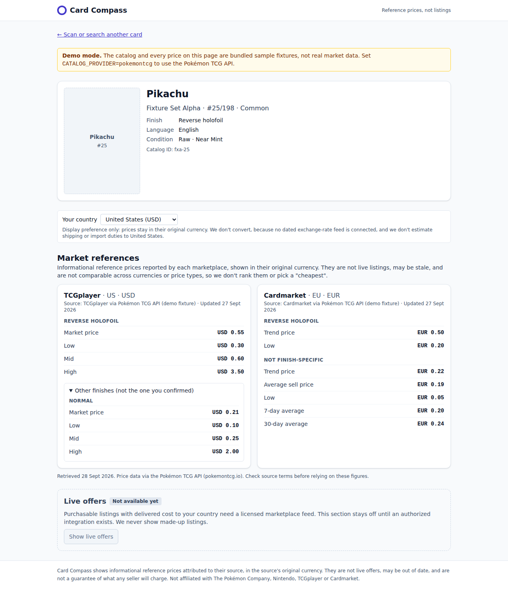

# Card Compass

A mock-first MVP for a Pokémon TCG card scanner with price references. You photograph or upload one
card. The app reads the name and collector number, suggests up to 5 catalog matches and explains
each one. You then confirm the exact printing: set, number, finish, language, and raw or graded
with condition. The app shows **source-attributed reference prices** in each source's original
currency: TCGplayer (USD) and Cardmarket (EUR), both via the Pokémon TCG API.

These are **informational reference prices, not live purchasable listings**. The app doesn't
convert currencies, rank sources or pick a "cheapest". When a value is missing it shows
"No quote available" rather than a zero or a guess.



## Status of integrations

| Integration | Status |
|---|---|
| Demo catalog + prices (`CATALOG_PROVIDER=mock`) | Working, the default. Bundled **invented** fixtures, labeled "Demo mode" in the UI. No network. |
| Pokémon TCG API v2 (`CATALOG_PROVIDER=pokemontcg`) | Adapter implemented and unit-tested against mocked HTTP. **Not verified against the live API here**: the build sandbox's network policy blocked `api.pokemontcg.io`. Verify with a real key before launch. |
| Mock OCR (`OCR_PROVIDER=mock`) | Working. Recognizes only the bundled fixture images in `fixtures/ocr/`. |
| Google Cloud Vision TEXT_DETECTION (`OCR_PROVIDER=google`) | Adapter implemented (REST, API-key auth) and unit-tested with mocked HTTP. **Not verified live.** |
| Live offers (eBay / TCGplayer / Cardmarket listings) | **Blocked, not built.** TCGplayer and Cardmarket aren't granting new API access. The UI section stays disabled and the `Offer` table stays empty. |

## Architecture

```
 Browser (Next.js client components)
   │  camera/upload ─► POST /api/scan ─────────┐
   │  manual search ─► GET  /api/cards/search  │
   │  confirm       ─► POST /api/scans/:id/confirm
   │  results       ─► GET  /api/cards/:id/prices
   ▼                                           ▼
 Route handlers (Node runtime, Zod validation, per-IP scan limit)
   │
   ├─ image.ts      sharp: sniff real format, EXIF-rotate, resize ≤2000px, re-encode (strips metadata) — in memory only
   ├─ ocr/          OcrProvider: MockOcrProvider | GoogleVisionOcrProvider
   ├─ matching/     parse.ts (name, HP, 025/198, TG05/TG30, promo; cautious O→0 / I→1 fixes)
   │                match.ts (catalog queries by combined clues → score → ≤5 candidates + reasons)
   ├─ catalog/      CatalogProvider: MockCatalogProvider | PokemonTcgProvider
   │                  (timeouts, jittered retries on 5xx/network, 429 → cooldown, per-minute/day limiter,
   │                   TTL cache with stale-if-error, API key in header only)
   ├─ prices.ts     provider price blocks → source-tagged PriceReference (currency, subtype, finish, as-of, stale)
   └─ repo.ts       Prisma/PostgreSQL, best-effort: Card, Scan, PriceSnapshot (Offer reserved)
                    → last stored references are served (labeled) if the source is down
```

## Quick start (no credentials needed)

```bash
cd card-compass
npm install
cp .env.example .env        # used by Prisma CLI
cp .env.example .env.local  # used by Next.js
npm run db:up               # docker compose Postgres 16 on :5432
npm run db:migrate          # apply prisma/migrations
npm run db:seed             # optional: demo cards + demo snapshots
npm run dev                 # http://localhost:3000
```

The database is optional. If `DATABASE_URL` is empty, the app runs without persistence: no scan
records and no stored-price fallback. If the database is unreachable, requests still succeed and
only a warning is logged.

To try the scanner in mock mode, upload one of `fixtures/ocr/*.png`:

- `pikachu-alpha.png` gives a clear high-confidence match.
- `pikachu-beta-fr-rotated.png` is a French card, rotated, with OCR misreads (`O25/1O8`). The set total separates it from another printing with the same name and number.
- `charizard-glare.png` has glare, so no number is read and the matches are ambiguous.
- `unreadable.png` gives no match and falls back to manual search.

## Environment variables

See `.env.example` for all of them. The main ones:

| Var | Default | Notes |
|---|---|---|
| `DATABASE_URL` | – | Postgres. Optional. |
| `CATALOG_PROVIDER` | `mock` | `mock` or `pokemontcg` |
| `POKEMONTCG_API_KEY` | – | Server-only, sent as the `X-Api-Key` header. Keyless works at lower limits. |
| `POKEMONTCG_LIMIT_PER_MINUTE` / `_PER_DAY` | 30 / 20000 keyed, 1000 keyless | Documented limits as of 28 Sep 2026. **Recheck before launch.** |
| `PRICE_CACHE_TTL_SECONDS` / `CATALOG_CACHE_TTL_SECONDS` | 21600 / 86400 | In-memory TTL caches |
| `PRICE_STALE_AFTER_DAYS` | 7 | A "Possibly stale" badge appears after this many days |
| `OCR_PROVIDER` | `mock` | `mock` or `google` |
| `GOOGLE_CLOUD_VISION_API_KEY` | – | Server-only. Restrict the key to the Vision API. |
| `MAX_UPLOAD_BYTES` | 8000000 | JPEG/PNG/WebP only, checked by content |
| `SCAN_LIMIT_PER_MINUTE` | 10 | Per client IP, in-memory |

No key is ever sent to the browser. Only server modules read `env.ts`, and it imports `server-only`.

## Tests

```bash
npm run lint          # ESLint (next core-web-vitals + TS)
npm run typecheck     # next typegen && tsc --noEmit
npm test              # Vitest unit tests (57)
npm run build         # production build
npm run test:e2e      # Playwright: starts `next start` on :3100 in mock mode; run after build
npm run screenshots   # needs the app on :3100; writes docs/screenshots/*.png (390px + 1280px)
```

The unit tests cover:

- **Parsing:** card numbers (`025/198`, `TG05/TG30`, promos, `O25/1O8` misreads, dates rejected).
- **Matching:** set disambiguation by printed total, ambiguous scans, no match, name/number conflicts, the 5-candidate cap.
- **Prices:** variant mismatch (no cross-finish substitution), currency formatting, unavailable source, zero/null values, stale quotes, undated blocks, link allow-list.
- **Pokémon TCG API adapter:** key in header only, caching, 429 → cooldown, 5xx/network retries, provider failure, stale-if-error, 404, local rate limits, timeouts.
- **Uploads and OCR:** upload validation, MIME sniffing, EXIF stripping and rotation, mock OCR, Google Vision request/response handling.

The E2E tests run at desktop 1280px and mobile 390px. They cover:

- Upload a fixture, choose the exact variant, and see source-tagged references with no listing.
- Manual search without OCR.
- A graded-card caveat.
- A variant mismatch showing "No quote available".
- A card with no prices.
- An unreadable scan falling back to manual search.
- The results URL rejected without a confirmed selection.

## Deployment notes

- Any Node host that runs `next start` works. Run `npm run db:deploy` against a managed Postgres, and set the env vars as secrets.
- The in-memory caches and rate limiters are **per instance**. On serverless platforms or with several instances, move them to a shared store such as Redis, or the upstream limits could be exceeded.
- Mock OCR reads `fixtures/ocr` from the working directory. It's meant for dev and test, not production.
- iPhone HEIC: the prebuilt `sharp` has no HEIC decoder. Safari normally converts camera captures to JPEG on upload, but HEIC files picked from Files are rejected with a clear message.

## Source, licensing and privacy checklist (before production)

- [ ] Re-read the Pokémon TCG API terms and rate limits (docs.pokemontcg.io). Confirm that commercial display of its `tcgplayer` / `cardmarket` price fields and card images is allowed for your use.
- [ ] Confirm the attribution wording and linking rules for TCGplayer and Cardmarket names and URLs. Links are restricted to an allow-list of https hosts (`src/lib/safe-url.ts`).
- [ ] Card images come from `images.pokemontcg.io`. Check image rights and Pokémon IP / trademark use, and add any required notices.
- [ ] Review Google Cloud Vision pricing, data-use terms and region, and restrict the API key.
- [ ] Privacy policy. Photos are processed in memory, re-encoded without metadata, and never written to disk or the database (`Scan.imageRetained` is always false). The DB stores only the parsed name and number and the confirmed card. Logs hold only event names and counts: no images, OCR text, keys or IPs.
- [ ] Do not advertise "live" or "cheapest" prices until licensed offer feeds and landed-cost inputs exist.

## Known limitations

- The Pokémon TCG API catalog covers English-language printings. For other languages the UI says the references don't apply directly. OCR can read non-Latin names, but matching then depends mostly on the collector number.
- The references aren't condition- or grade-specific. The UI says so whenever you confirm a graded card or a condition below NM.
- Cardmarket's non-reverse fields aren't finish-specific, so they appear under "Not finish-specific".
- OCR doesn't detect condition, finish or language. You always confirm them yourself, and nothing is auto-selected.
- The country selector is a display preference only. There is no FX conversion, shipping or duties.

## Future phase (only after rights and access are verified)

Add a `LiveOfferProvider` adapter that writes to the reserved `Offer` model, deduplicated on
provider + listing id + card + finish. Before building it:

1. Get written feed/access terms covering attribution, caching and redistribution.
2. Validate each listing's print, language, finish, condition, grade, stock, seller and ship-to country, shipping, tax/duties, dated FX and seller credibility.
3. Show a delivered-cost comparison only when every input is known. Otherwise show "total unknown" and don't rank the listing.
4. Keep completed sales separate from asking prices.
5. Add metrics to test whether buyers value a landed-cost comparison for their destination over existing multi-market tools such as Collectr.
