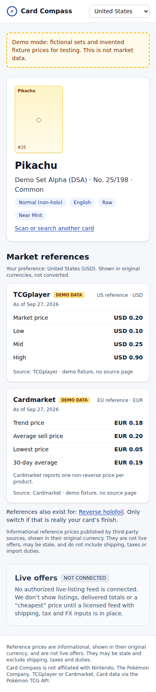
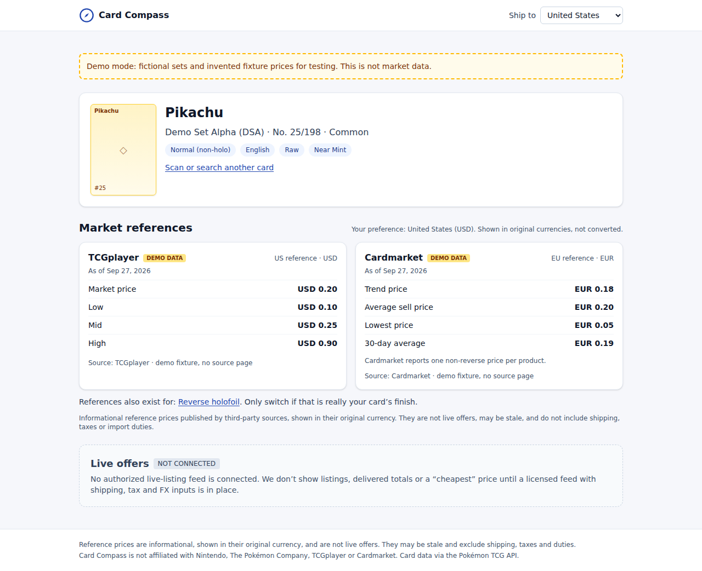

# Card Compass

A Pokémon TCG card scanner (MVP). Photograph or upload one card, confirm the exact printing
(set, number, language, finish, raw/graded, condition), then see **source-attributed reference
prices** from TCGplayer (USD) and Cardmarket (EUR) in their original currency, with the as-of date.

> These are informational reference prices, **not live purchasable listings**. There is no
> "cheapest" ranking, no currency conversion and no delivered-cost estimate. The "Live offers"
> section is a disabled placeholder until a licensed feed exists.

The app runs fully **without credentials**: mock OCR and a demo catalog (fictional "Demo Set …"
sets with invented prices, labelled `DEMO DATA` in the UI) are the defaults.

| Mobile (390px) | Desktop (1280px) |
| --- | --- |
|  |  |

More in [`docs/screenshots/`](docs/screenshots): home, candidate review and confirmation at both widths.

## Architecture

```
 Browser (Next.js client components; no keys, no third-party calls)
   │  photo (multipart)        │ ?q=            │ selection
   ▼                           ▼                ▼
 POST /api/scan          GET /api/cards/search   GET /api/cards/[id]/prices   POST /api/scans/[id]/confirm
   │ validate type/size (magic bytes)
   │ sharp: auto-rotate, resize, strip EXIF/GPS (memory only, never stored)
   ▼
 OcrProvider ──► MockOcr (fixture hashes)  |  VisionOcr (Google Cloud Vision TEXT_DETECTION)
   │ text
   ▼
 parseClues()  name, collector no. (025/198, TG05/TG30, SWSH050), set codes, language hint
   ▼
 CatalogProvider ──► MockCatalog (demo)  |  PokemonTcgCatalog (api.pokemontcg.io/v2)
   │                                          ├ fetchJson: timeout, retry+jitter, Retry-After, no redirects
   │                                          ├ RequestBudget: 30/min, 20k|1k/day (configurable)
   │                                          └ TtlCache: catalog 24h, prices 6h
   ▼
 rankCandidates()  exact number + set size + set code + name  ─►  ≤5 candidates with reasons
   ▼                                                            (buyer must confirm; never auto-selected)
 buildReferenceView()  filter by finish/language/grading → rows, "No quote available", stale flags
   ▼
 Postgres (Prisma, optional): Card, Scan(imageRetained=false), PriceSnapshot, Offer (reserved, empty)
```

Key files:

| Path | Purpose |
| --- | --- |
| `src/app/api/**/route.ts` | API routes (Zod-validated) |
| `src/lib/match/parse.ts`, `score.ts` | OCR text → clues → scored candidates |
| `src/lib/price/pokemontcg-prices.ts` | Extracts USD/EUR references from the API's `tcgplayer`/`cardmarket` blocks |
| `src/lib/price/select.ts` | Applies the buyer's confirmed selection; no-quote reasons; staleness |
| `src/lib/catalog/pokemontcg.ts` | Pokémon TCG API v2 adapter |
| `src/lib/catalog/mock-data.ts` | Demo catalog (fictional) |
| `src/lib/ocr/*` | OCR interface, mock and Google Vision implementations |
| `src/lib/server/*` | env, HTTP client, rate budget, cache, image sanitizing, logging, DB repo |
| `src/lib/safe-url.ts` | Allowlist for source/image links (no open redirects / `javascript:`) |
| `prisma/schema.prisma` | Data model |
| `fixtures/scans/*.png` | Card-like OCR fixtures (glare, rotation, Japanese, blank) |

## Setup

Requires Node ≥ 20.9. Docker is optional.

```sh
cd card-compass
npm install
cp .env.example .env          # defaults: mock catalog + mock OCR
npm run dev                   # http://localhost:3000
```

With no `DATABASE_URL` the app still works (in-memory cache only). To use Postgres:

```sh
npm run db:up                 # docker compose Postgres 16 on :5432
npx prisma migrate deploy     # or: npm run db:migrate (dev)
npm run db:seed               # demo cards into the Card table
```

In mock mode, only the fixture images in `fixtures/scans/` are "recognized" (by SHA-256). Try
`pikachu-dsa.png` (clear match), `pikachu-no-setcode.png` (ambiguous reprint),
`charizard-glare.png` (damaged name, `0O6/198`), `pikachu-japanese.png` or `blank-back.png`.
Manual search works for anything in the demo catalog (`pikachu`, `charizard ex`, `eevee 133`).

### Environment variables

| Variable | Default | Notes |
| --- | --- | --- |
| `CATALOG_PROVIDER` | `mock` | `pokemontcg` for the real API |
| `POKEMONTCG_API_KEY` | – | Optional. Sent only as the `X-Api-Key` header from the server |
| `POKEMONTCG_BASE_URL` | `https://api.pokemontcg.io/v2` | |
| `POKEMONTCG_LIMIT_PER_MINUTE` | `30` | Documented limits as of 28 Sep 2026. **Recheck before launch** |
| `POKEMONTCG_LIMIT_PER_DAY_KEYED` / `_KEYLESS` | `20000` / `1000` | |
| `OCR_PROVIDER` | `mock` | `vision` for Google Cloud Vision |
| `GOOGLE_APPLICATION_CREDENTIALS` | – | Path to a service-account JSON (or use attached GCP identity) |
| `DATABASE_URL` | – | Postgres; optional |
| `CATALOG_CACHE_TTL_SECONDS` / `PRICE_CACHE_TTL_SECONDS` | `86400` / `21600` | |
| `PRICE_STALE_AFTER_DAYS` | `7` | Rows older than this get a "Stale" badge |
| `UPLOAD_MAX_BYTES` | `8000000` | |
| `OUTBOUND_TIMEOUT_MS` | `8000` | |

No variable is prefixed `NEXT_PUBLIC_`; nothing secret reaches the browser bundle. `.env` is git-ignored.

## Tests

```sh
npm run lint
npm run typecheck
npm test                      # Vitest unit + route-handler tests
npm run build
npm run e2e                   # Playwright: starts `next start` on :3100 with mock providers
```

Unit coverage includes collector-number parsing and OCR confusions, set disambiguation, ambiguous
duplicate-artwork scans, no match, variant (finish) mismatch, currency formatting, unavailable
prices, stale quotes, graded/non-English selections, local and upstream rate limits (429 +
Retry-After), provider failure/timeouts, SSRF/redirect-safe URLs, upload validation and EXIF
stripping. E2E covers scan → confirm → references (no listings, no links, no "cheapest"),
manual search without OCR, "No quote available", stale flag, "None of these", bad upload, and a
429 state with retry. `e2e/screenshots.spec.ts` regenerates `docs/screenshots/`.

If Playwright can't find its browser, point it at an installed Chromium with
`PLAYWRIGHT_CHROMIUM_PATH=/path/to/chrome npm run e2e`. Regenerate OCR fixtures with
`npm run fixtures:scans` (this also rewrites `src/lib/ocr/mock-fixtures.json`).

## Deployment

1. Provision Postgres; set `DATABASE_URL`; run `npx prisma migrate deploy`.
2. Set `CATALOG_PROVIDER=pokemontcg` and `POKEMONTCG_API_KEY` as server-side secrets.
3. Optional OCR: enable the Cloud Vision API, create a least-privilege service account, provide
   credentials via the platform's secret store, set `OCR_PROVIDER=vision`. Review Vision pricing.
4. `npm run build && npm start` (Node runtime; `sharp` needs a platform-matching install).
5. The rate budget and cache are **per process**. With multiple instances, lower the limits per
   instance or move them to a shared store.

## Source & license checklist (before production)

- [ ] Re-read the Pokémon TCG API terms and current rate limits; confirm commercial use and caching are allowed.
- [ ] Confirm the display rights for TCGplayer and Cardmarket price fields as surfaced through that API, including the required attribution and links.
- [ ] Confirm the rights to use the card images (`images.pokemontcg.io`) and Pokémon trademarks and branding in your context.
- [ ] Google Cloud Vision: data-processing terms, region, pricing, and a quota alert.
- [ ] Privacy notice: photos are processed in memory and not stored. Scan rows keep only the parsed name and number.
- [ ] Do not advertise "live" or "cheapest" prices until licensed feeds and landed-cost inputs exist.

## Status of integrations

| Integration | Status |
| --- | --- |
| Mock OCR + demo catalog | Implemented and tested |
| Pokémon TCG API v2 adapter | Implemented and unit-tested against synthetic responses. **Not exercised against the live API in this environment** (outbound access was blocked). Verify with a key before relying on it. |
| Google Cloud Vision OCR | Implemented (`batchAnnotateImages` / `TEXT_DETECTION`). **Not exercised live** (no credentials here). |
| Live offers (eBay / TCGplayer / Cardmarket listings) | **Blocked.** No authorized access. The `Offer` table and UI placeholder are reserved and not populated. |
| FX conversion, shipping, duties | Not implemented by design. The country selector is display-only. |

## Known limitations

- OCR reads text only. It can't reliably detect finish, condition, grade or edition, so the buyer confirms those. Heavy glare, holo foil or very small photos may yield no text; manual search is the fallback.
- Name matching is English-only. Non-English cards can still match by collector number, but price references are shown only for English printings.
- Cardmarket publishes one non-reverse price per product. When a printing has both a normal and a holofoil finish, those Cardmarket figures are not assigned to either.
- References are not condition-specific or graded. The UI says so instead of adjusting prices.
- The rate budget and caches live in memory per instance (see Deployment).
- `npm audit` reports advisories in dev-only tooling (the Prisma CLI's config loader and Vitest's mocker). They are not in the runtime bundle.

## Future phase (only after rights and access are verified)

Add a `LiveOfferProvider` adapter per licensed source. Before building one, obtain written feed terms covering attribution, display, caching and redistribution scope. For each listing, validate print, language, finish, condition, grade, stock, seller country, ship-to country, shipping, tax and duties, the FX timestamp, and seller credibility. Show a comparable delivered cost only when every input is known; otherwise mark it "total unknown" and don't rank it. Keep completed sales separate from active asking prices. Never crawl around denied API access. Add metrics to test whether buyers value destination-specific landed comparison over existing multi-market apps.
